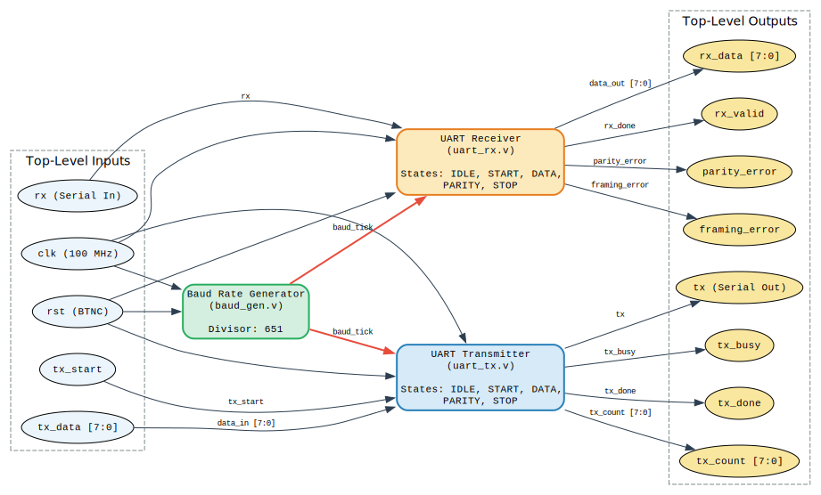
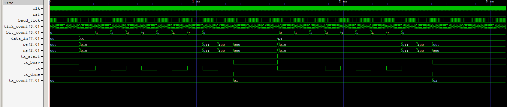
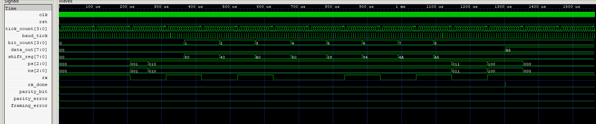
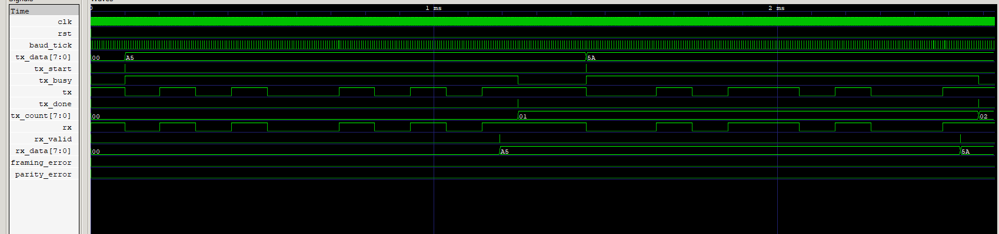

# UART Transceiver — RTL Implementation in Verilog   

**9600 baud | 8E1 | 16x oversampling | Basys3 (100 MHz)**

---

## Overview

Full-duplex UART transceiver implemented in synthesizable Verilog. Includes a baud rate generator, FSM-based transmitter, FSM-based receiver with noise rejection and parity checking, and a loopback testbench suite.

Designed for the Digilent Basys3 FPGA (Artix-7). Simulated with Icarus Verilog and GTKWave.

---

## Repository Structure

```
UART-Transceiver-AsyncFIFO-RTL/
├── baud_gen.v          # Baud rate generator (16x oversampling, divisor = 651)
├── uart_tx.v           # UART transmitter FSM (8E1)
├── uart_rx.v           # UART receiver FSM (8E1, noise rejection)
├── uart_top.v          # Top-level integration module
├── tb_uart_tx.v        # TX standalone testbench
├── tb_uart_rx.v        # RX standalone testbench
├── tb_uart_top.v       # Full loopback testbench
└── Architecture.svg    # Module hierarchy diagram
```

---

## Architecture



`uart_top` instantiates three submodules. `baud_gen` produces the shared 16x oversampling tick distributed to both TX and RX.

```
clk, rst ──► baud_gen ──► baud_tick ──► uart_tx ──► tx
                                    └──► uart_rx ──► rx_data, rx_valid
```

---

## Module Summary

### `baud_gen.v`
Divides the 100 MHz system clock to produce a `tick` pulse at 16× the baud rate.

- `DIVISOR = CLK_FREQ / (BAUD_RATE × OVERSAMPLE) = 651`
- Baud error: ~0.007%

### `uart_tx.v`
FSM states: `IDLE → START → DATA → PARITY → STOP`

- LSB-first transmission
- Even parity (configurable via `PARITY_ENABLE`)
- Outputs: `tx`, `tx_busy`, `tx_done`, `tx_count`

### `uart_rx.v`
FSM states: `IDLE → START → DATA → PARITY → STOP`

- Samples at tick 8 (mid-bit center)
- Start-bit noise rejection: aborts to IDLE if line returns HIGH at mid-start-bit
- Even parity check and framing error detection
- Outputs: `rx_data`, `rx_valid`, `parity_error`, `framing_error`

### `uart_top.v`
Integrates all three submodules. All signals are exposed at the top level for easy integration or loopback testing.

---

## Port Reference

### `uart_top`

| Port | Dir | Width | Description |
|---|---|---|---|
| `clk` | in | 1 | 100 MHz system clock |
| `rst` | in | 1 | Active-high synchronous reset |
| `rx` | in | 1 | Serial data input |
| `tx_start` | in | 1 | Pulse to begin transmission |
| `tx_data` | in | 8 | Byte to transmit |
| `tx` | out | 1 | Serial data output |
| `tx_busy` | out | 1 | High while transmitting |
| `tx_done` | out | 1 | Pulses when frame completes |
| `tx_count` | out | 8 | Frames transmitted (wraps at 255) |
| `rx_data` | out | 8 | Received byte |
| `rx_valid` | out | 1 | Pulses when frame is valid |
| `parity_error` | out | 1 | Pulsed on parity mismatch |
| `framing_error` | out | 1 | Pulsed if stop bit is not HIGH |

---

## Simulation

### TX Testbench



```
iverilog -o sim tb_uart_tx.v baud_gen.v uart_tx.v
vvp sim
```

Sends two frames (0xAA, 0x54). Checks `tx_count == 2` at end.

### RX Testbench



```
iverilog -o sim tb_uart_rx.v baud_gen.v uart_rx.v
vvp sim
```

Drives a manually-constructed 8E1 frame for 0xA5 onto `rx`. Verifies `data_out` and `rx_done`.

### Top Loopback Testbench



```
iverilog -o sim tb_uart_top.v baud_gen.v uart_tx.v uart_rx.v uart_top.v
vvp sim
```

Connects `tx` directly to `rx`. Sends 0xA5 then 0x5A. Checks that `rx_data` matches after each frame.

**Expected output:**
```
=> PASS: Loopback received 0xa5 accurately!
=> PASS: Loopback received 0x5a accurately!
=== UART TOP LOOPBACK COMPLETED ===
```

---

## Parameters

| Parameter | Default | Location | Description |
|---|---|---|---|
| `CLK_FREQ` | 100_000_000 | `baud_gen` | System clock frequency |
| `BAUD_RATE` | 9600 | `baud_gen` | Target baud rate |
| `OVERSAMPLE` | 16 | `baud_gen`, `uart_rx`, `uart_tx` | Oversampling factor |
| `PARITY_ENABLE` | 1 | `uart_tx` | 1 = even parity, 0 = 8N1 |
| `DATA_BITS` | 8 | `uart_rx` | Bits per frame |

---

## Tools

- Simulation: [Icarus Verilog](http://iverilog.icarus.com/)
- Waveform: [GTKWave](http://gtkwave.sourceforge.net/)
- Target: Digilent Basys3 (Xilinx Artix-7, xc7a35t)
- Synthesis: Vivado 2024.x (tested)

---

## Future Work

- Async FIFO for TX and RX buffering (multi-byte queuing)
- Configurable stop bits (1 or 2)
- Runtime-programmable baud rate (AXI-Lite or register interface)
- Hardware loopback test on Basys3 via PMOD UART
- Formal verification with SymbiYosys

---

## License

MIT
